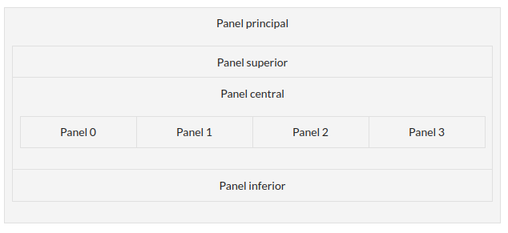

# Ejercicio UT2-E2 Layouts
Crea una aplicación que permita mostrar información sobre un **estival de música**.
- Tendrá la siguiente disposición:

- El **panel principal** solo será el **contenedor** de los paneles superior, central e inferior; el panel central tendrá a su vez tres paneles que se encontrarán en forma de cartas. Si lo deseas, puedes poner borde o fondo a los paneles para que se distingan mejor.
- **Inicialmente** al cargar la aplicación se mostrará el panel 0 donde se indicarán **datos generales del festival** (por ejemplo el lugar, o la fecha); en el panel superior se verán los tres botones activados; y en el panel inferior habrá una etiqueta donde se mostrará el mensaje “Pulsa sobre los botones para ver información del festival”.
- En el panel superior se encontrarán los tres botones con los tres días del festival y la etiqueta:
    * Cuando se pulse el botón de cada uno de los días se visualizará el panel central correspondiente a la información de ese día.
    * El botón que se encuentre pulsado en el momento se encontrará desactivado.
    * En la etiqueta aparecerá el día y el horario de los conciertos del día que se encuentra activado en ese momento.
- El panel central tendrá tres paneles en su interior, pero solamente se visualizará uno de cada vez.
    * Cada panel interior tendrá la información sobre el día del festival que se encuentre marcado en ese momento.
    * Si lo deseas, puedes poner color de fondo a cada panel para diferenciarlos unos de otros.
- En el panel inferior habrá dos botones: uno para restaurar la aplicación y que se muestre nuevamente el panel 0 y se activen los tres botones del festival y otro que permita salir de la aplicación.
- No se podrá salir de la aplicación pulsando el botón X de la ventana.

